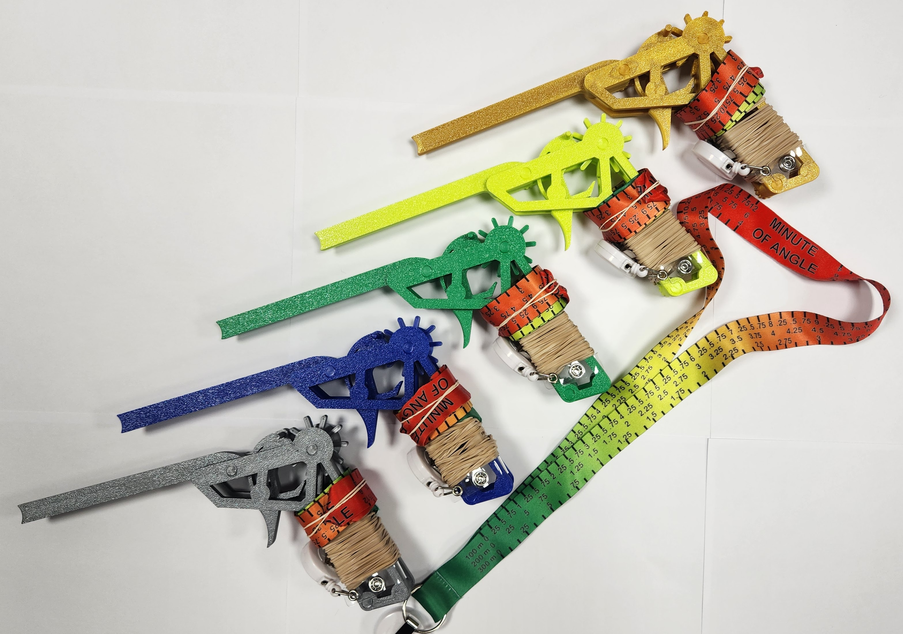

# Defcon Shoot 32 Rubber Band Gun Badge

****
I 3d printed some rubber band guns that are used as entry badges for the defcon shoot (instead of paper badges). The lanyard concept and design was done by Hamsa. There is a retractable spool at the end of the lanyard so you can aim and use your rubber band gun without taking off your lanyard.

### Usage suggestions:
* Always put the rubber bands on top of the pin that is on top of the trigger, this keeps the rubber bands from catching on the barrel or trigger
* I included 40 rubber bands size 12 or 1-3/4" x 1/16"
* You can load 6-7 rubber bands, load the furthest back first and move toward loading the front
* The front rubber band often slips off when manually loading it, but this doesn't happen when the wheel is "cycled" into that position
* You can load a few, then move the wheel backwards by putting backward pressure on it and slowly pullying and releasing the trigger (this is how you can load 7)

I modified this original design: https://www.thingiverse.com/thing:5950314

## Detailed changes:

#### Wheel
Thinner to match the trigger and barrel. 
The thickness is thin enough to avoid getting pinched between the frames and having too much friction, while not leaving a large enough gap for rubber bands to get caught in.
Re-profiled so the cone shape that keeps the rubber band against the cogs aligns with the frame.
Printed on a smooth build plate so it isn't textured on one side. 

#### Trigger
Thinner to match the wheel and barrel.
Thin enough to avoid getting pinched between the frames and having too much friction. 

#### Left side frame
Grip shortened
All threads moved to left side, and threads redone.
A cone is added around the wheel to match the angle of the wheel so rubber bands rest against the wheel.

#### Right side frame
Grip shortened.
Holes for bolts adjusted.
Bottom grip spacer added around the bolt so the left and right frames are pinched together.
Removed one cross-support since it wasn't needed, and removing it allows a better view of the trigger.
A cone is added around the wheel to match the angle of the wheel so rubber bands rest against the wheel.
Re-profiled all pins.

#### Barrel
Thinner to match the trigger and barrel.
The back was curved to avoid having rubber bands potentially hitting a sharp corner. 
The barrel is the only piece that isn't 100% solid when I printed it. 

#### Bolts
Threads redone
Knurled edges added to make it easier on fingers
Solid shaft added so threads can not be overtightened causing the wheel and trigger to be pinched. This allows the bolts to "bottom out"
Length adjusted so threads don't stick out the end (especially after barrel, wheel, and trigger thickness were changed)
Printed with dynamic layer height so the threads have better quality, and fewer overhangs. 

#### Trigger pin
Length extended so rubber bands don't fall under the pin while loading
Tip of the pin is tapered to make it easier to install
The base of the pin has a increased thickness so the pin can be inserted to refusal and be sticking out the right amount on each side

